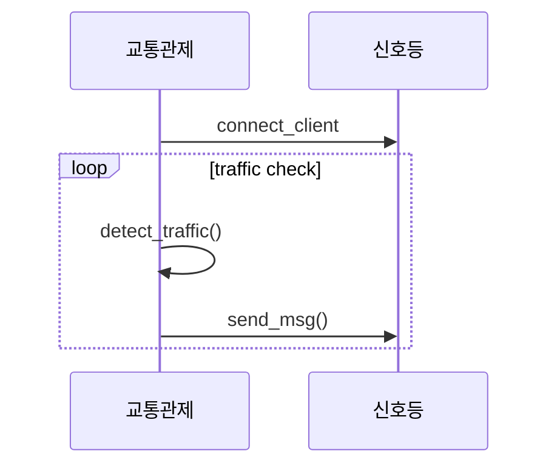
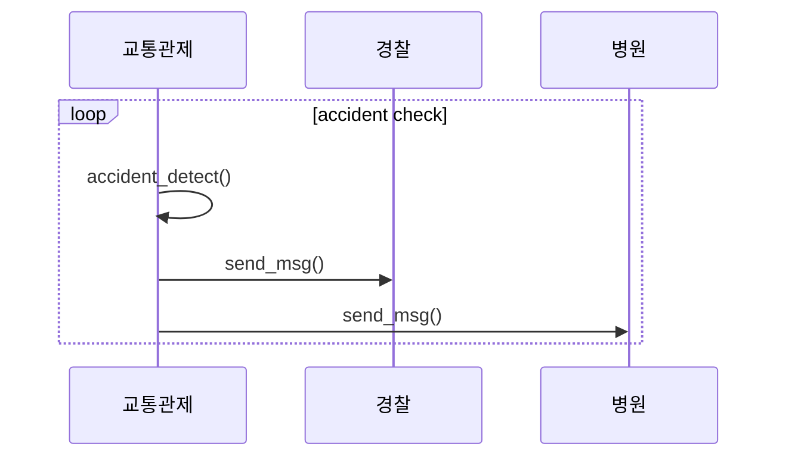

# Traffic_control
도로위의 차량 숫자에 따른 신호등(LED)제어 및 사고 감지 모델

# cctv_ctrl

## Team project

### <<프로젝트 요약>>
#### 프로젝트 주제
* 다목적 CCTV 상황제어
거리에 있는 CCTV를 이용하여 트래픽에 따른 신호등 제어 및 각종 사건사고 감지

* 유스케이스


* 흐름도


* 시퀀스 다이어그램




## 111702.py환경설정  
--- python3.8 사용 ---
```py
#yolov8s.pt설치방법
https://github.com/ultralytics/assets/releases/download/v0.0.0/yolov8s.pt
```
```py
pip install opencv-python
pip install supervision
pip install YOLO
pip install numpy
```
## 112202.asm환경설정
--- pb9,pb13,pb15사용 ---
```c
sudo apt-get install gdb
sudo apt-get install gdb-multiarch
(GNU gdb (Ubuntu 12.1-0ubuntu1~22.04) 12.1)
sudo apt-get install openocd
(Open On-Chip Debugger 0.11.0, Licensed under GNU GPL v2)
sudo apt-get install stlink-tools
(stlink-server v2.1.1)
```
## stm32는 ide를 사용한 방법
aa.7z은 stm32 ide 전체파일 , import socket.py는 통신 기본 코드

## stm32 assembly를 통한 제어
### 112202.asm 사용법
```asm
#컴파일 방법
arm-none-eabi-as -mcpu=cortex-m4 -c file.asm -o file.o
arm-none-eabi-ld file.o -o file.elf -Ttext=0x08000000 
```
```asm
#작동방법
assembly coding
openocd -f interface/stlink.cfg -f target/stm32f4x.cfg
#gdb port 변경
openocd -f interface/stlink.cfg -f target/stm32f1x.cfg -c "gdb_port port_number"
새로운 터미널 열고 gdb(gdb-multiarch)
load 파일위치/file.elf 또는 file 파일위치/file.elf
continue 또는 run
```

```통합 명령
#컴파일 방법
arm-none-eabi -as -mcpu=cortex-m4 YourFileName.asm -o YourFileName.o && arm-none-eabi -ld YourFileName.o -o YourFileName.elf -Ttext=0x8000000 && openocd -f /YourPath/stlink.cfg -f /YourPath/stm32f4x.cfg -c "init; program start.elf; reset; exit;"
```

## final.py 실행
```python
pip install opencv-python
pip install "openvino>=2023.2.0"
pip install supervision
pip install ultralytics
```

```cmd
python ./final.py [CPU or GPU] [video_path] # default webcam 0
```

* Project Github : https://github.com/dnfm257/cctv_ctrl.git
* 관련 영상:https://clipchamp.com/watch/0EiDqAf3Iuv
            https://clipchamp.com/watch/jSr9qMYNIvi


